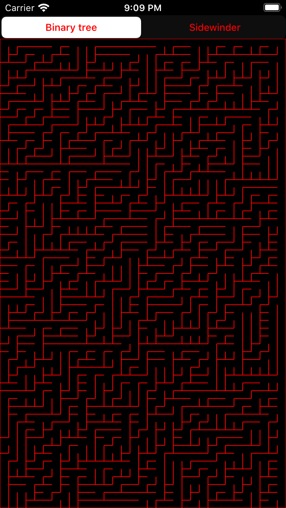

# Mazes

Mazes are a very intriguing subject to me, and with this project I wanted to experiment with building and solving them.

I started by introducing some data structures that can be used as building blocks for building a maze.
These are intentionally generic in order to allow building (potentially) any kind of maze in the future, for example not only 2D mazes, but also 3D, or circular or other shapes... And why not, something that can be used for rendering a game and navigating into a maze in 3D.

So far I was able to produce random generated mazes and have them displayed in some forms.
The output isn't very essentially at this stage, but once you have produced the data structure, drawing on screen as ASCII or by drawing primitives should be quite straightforward (and totally indipendent from the model).

5x5 ASCII maze generated with Binary Tree algorithm
```
+---+---+---+---+---+
|                   |
+---+   +   +---+   +
|       |   |       |
+---+   +---+   +   +
|       |       |   |
+   +   +---+   +   +
|   |   |       |   |
+   +   +   +---+   +
|   |   |   |       |
+---+---+---+---+---+
```

8x15 ASCII maze generated with Binary Tree algorithm
```
+---+---+---+---+---+---+---+---+---+---+---+---+---+---+---+
|                                                           |
+---+   +   +---+   +   +---+   +   +---+   +---+   +---+   +
|       |   |       |   |       |   |       |       |       |
+---+---+---+---+   +   +   +---+   +---+   +---+   +---+   +
|                   |   |   |       |       |       |       |
+---+---+---+---+---+   +   +---+---+---+---+   +   +   +   +
|                       |   |                   |   |   |   |
+   +   +   +   +   +   +   +---+---+---+---+   +---+   +   +
|   |   |   |   |   |   |   |                   |       |   |
+---+   +---+---+   +---+---+---+---+   +---+---+---+   +   +
|       |           |                   |               |   |
+   +   +---+   +   +   +   +---+   +   +   +   +---+---+   +
|   |   |       |   |   |   |       |   |   |   |           |
+   +   +   +---+---+---+   +   +   +---+   +---+   +   +   +
|   |   |   |               |   |   |       |       |   |   |
+---+---+---+---+---+---+---+---+---+---+---+---+---+---+---+
```

10x10 ASCII maze generated with Sidewinder algorithm
```
+---+---+---+---+---+---+---+---+---+---+
|                                       |
+---+---+---+   +---+   +---+---+   +   +
|               |           |       |   |
+   +---+---+   +   +---+   +---+   +---+
|       |       |       |   |           |
+   +   +---+   +   +---+   +---+   +   +
|   |   |       |       |       |   |   |
+---+   +   +   +---+---+---+---+---+   +
|       |   |       |                   |
+---+   +---+---+   +---+---+---+   +   +
|       |                       |   |   |
+   +   +   +---+---+---+---+   +---+---+
|   |   |   |                           |
+   +   +---+   +   +   +   +---+---+   +
|   |       |   |   |   |   |           |
+---+   +---+   +   +   +   +---+   +   +
|       |       |   |   |       |   |   |
+   +---+---+   +---+   +   +---+   +---+
|       |       |       |       |       |
+---+---+---+---+---+---+---+---+---+---+
```

**Basic iPhone UI**

Yeah, maybe not very exciting stuff so far, but it shows the potential? :-)


